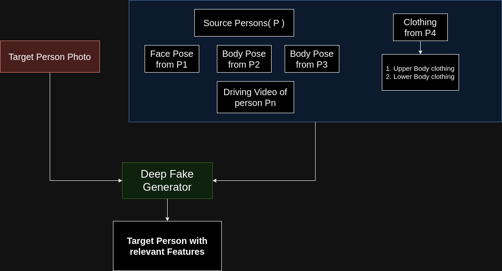

# DeepFakeKing

## Contribution to the repo

1. You can contribute to the repo with the **survery**. Add a readme file with relevant name in the survey folder, do all the necessary survey and place it in the readme file of the main branch.
2. You can contribute to the repo with codes that can help either model training/testing for full body deep fake generation and detection. The **src** folder consists of all the code you need to fill. Ideally in the end, the user should be able to config the model spec in the toml file and should run the config.toml file for processing the operation. We have two seperate folder since one is for generation and one is for detection.
3. You can contribute to the **notebooks** session. Once the code has been written, the contributer can explain things of specific logics(use latex for math) or detail information(algorithm) or experiments(hyper parameter tuning) performed using the notebook.
4. You can contribute to the **docs** session. Once the code is built, the docs should have an ideal readme of specific config file that have been used during training and testing. It would be highly preferred one can do the same exp again leading to the same result. You can explain about things in detail here as well.

Choose the one and you can start contributing now.

### Coding Format

In the src folder there is a high chance a model can be either trained or tested. So I would recommend to have a script for each one. For more information look at the yolov5 github repo. So do have individual scripts for each of the operations you about to do. The operation can be even more complicated where you have to generate a video from an image data. These should have individual script, but should be linked to main.py in the end. The configurations are to be made inside the toml file which is fed to main.py file.

The directory tree has to look like this all the time. The number of folders can be added by necessity.

```bash
├── deepfakedetection
│   ├── config.toml
│   ├── main.py
│   ├── models
│   │   └── unet.py
│   └── utils
│       └── video_operations.py
```

Once the code ready and you have made a train and test script. Please do make an relevant notebook and doc related to that.

## Deep Fake Generation Roadmap

This is a repository consists of survey and works related to full body deep fake generation. The goal is to generate a full body deep fake generation of a driving video/ static image using single source image of a person.



### Survey

1. [Datasets for DeepFake Generation.](survey/DeepFakeGenerationDatasets.md)
2. [Models for DeepFake Generaion.](survey/DeepFakeGenerationModels.md)
3. [Person Keypoints Detection.](survey/BodyKeypoints.md)

## Deep Fake Detection Roadmap
